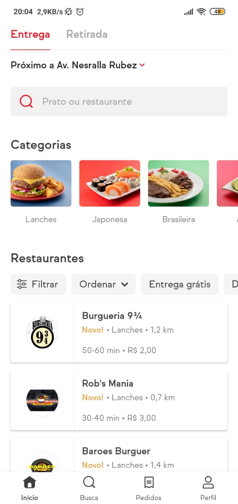
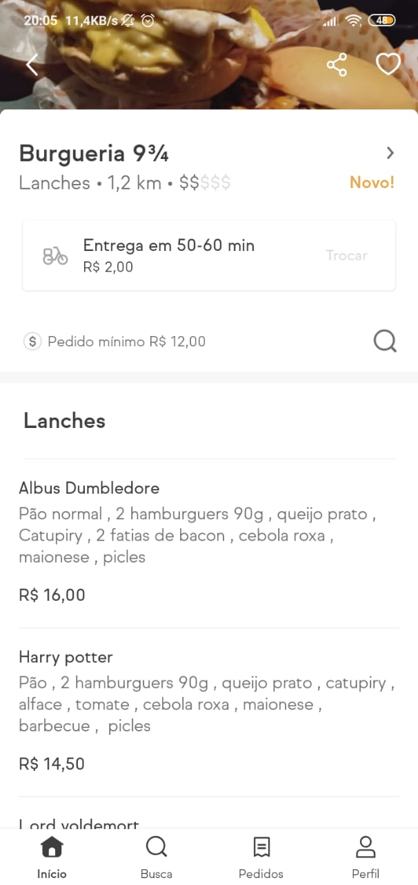

# FoodInVale

## Home



## Restaurante



## API

A api rest está configurada com o json server. O json-server está instalado neste projeto, mas se você quiser pode instalar ele de maneira global. Tanto faz ;)

Para instalar de maneira global execute `npm install -g json-server`

```bash
npx json-server server.json -p 3333 -w -d 500
```

Esse comando irá executar o servidor na porta 3333. O parâmetro _-d 500_ é para simular um delay no retorno, simular a latência da rede por exemplo. O _-w_ é para que toda alteração no arquivo `server.json` seja refletida automaticamente.

No arquivo server.json estão as configurações das rotas e os dados.

### **Api Methods**

| Method | Endpoint                  | Parameters  | Description                                                                                                                      |
| ------ | ------------------------- | ----------- | -------------------------------------------------------------------------------------------------------------------------------- |
| `GET`  | _/restaurants_            | none        | Consulta todos os restaurantes cadastrados no server. É possível fazer paginação e colocar um limite utilizando _page_ e _limit_ |
| `GET`  | _/restaurants/:id/dishes_ | _id:_ `int` | Busca todos os pratos de do restaurante específico                                                                               |
| `GET`  | _/dishes_                 | none        | Consulta todos os pratos                                                                                                         |
